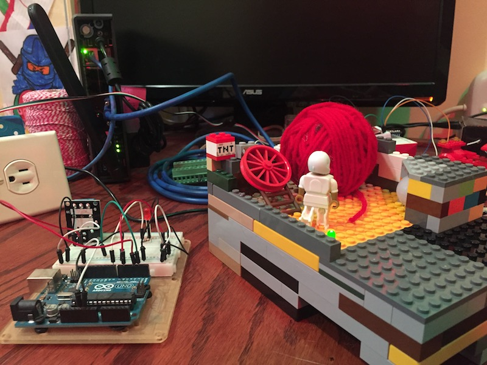

# Giant Ball of String

Giant Ball of String (GBoS) is a sample demonstration applicaiton that illustrates how several technologies from Cisco can be brought together to address a business problem.  

## Demo Application Background

All across the United States, there are roadside attractions like *The Worlds Largest Fork*, *The Biggest Donut*, and *The Giant Ball of String*.  The organization that manages these attractions is facing pressure to provide better metrics and details about the visitors to the attractions, and to provide a better experience for those visitors.  If they can't meet this demand, they may see their funding reduced.  

To address this problem, the technical staff has built their next generation attraction support platform.  This platform provides the following capabilities:

* Monitor activity at each site using motion detectors.  
* Turn on lights, signage, and resources at each site only when vistors are present
* Provide centralized logging of visits at all attractions
* Informational Kiosks at each attraction 
* Direct interaction with visitors by providing facts and Q/A through their mobile devices

## Other Demo Repositories

This repository and README provide overall details on the Demonstration application and how to deploy the full demonstration.  

The following repositories are where the actual code for the different involved micro-services/components are located.  

* [gbos_demo](https://github.com/imapex/gbos_demo) - Full Demo Application Setup and Details
* [gbos_iox](https://github.com/imapex/gbos_iox) - Details on the Cisco IOx Client Application 
* [gbos_arduino](https://github.com/imapex/gbos_arduino) - Details on the Arduino Microcontroller Code 
* [gbos_kiosk](https://github.com/imapex/gbos_kiosk) - Details on the Welcome Web Portal Page
* [gbos_tropo](https://github.com/imapex/gbos_tropo) - Details on the Tropo Service for SMS based communication with visitors

# Demo Setup Steps

Within the GBoS Demonstration there are two Application Components that you'll need to setup.  Each of these are independent of each other.  You could do a modified demo of using only one component

## Location Management 

This component monitors activity at the site for the following purposes:

* Log and notify whenever new activity is detected at a site
* Turn on and off the lights (and other resources) at the site 

There are 4 main technologies involved in this component: 

* Cisco IOx Router - ***Required***
    * Provide internet connectivity and network access at the site
    * Host the site monitoring PaaS application 
    * Integrate with the analog controller over serial 
* Arduino Microcontroller - ***Required***
    * Leverage Motion Detection to identify activity 
    * Control lights (and other things)
* Cisco Zeus - ***Optional***
    * Cloud based logging and reporting for activity at all sites
    * *Future Feature*
        * A reporting interface could be built to provide dashboards about activity at all sites
* Cisco Spark - ***Optional***
    * Used to notify administrators real-time whenever a visitor arrives 

### Setup Instructions 

1. First setup and deploy [gbos_arduino](https://github.com/imapex/gbos_arduino)
2. Second setup and deploy [gbos_iox](https://github.com/imapex/gbos_iox) 

## User Interaction 

This component provides an improved user experience at a site.  A small "kiosk" will be installed at each location.  The target platform would be a small table device.  

This kiosk provides visitors: 

* Basic site information and details  
* Users can also provide their mobile phone number to have details sent directly to them over SMS, and they can ask questions from their personal devices 

There are 3 main technologies involved in this component: 

* Container-ized Web Application
    * to provide the kiosk web page 
    * This application could be run nearly anywhere, including locally on the IOx Router, but for the demo we will run it in a Mantl stack, though likely not highlight this fact much
* Cisco Tropo Application
    * Provides the ability to interact with users via SMS messaging 
* *Future Feature* Cisco Spark 
    * Allow a "call center" of experts to easily reply back to questions from visitors

### Setup Instructions 

1. First setup and deploy [gbos_kiosk](https://github.com/imapex/gbos_kiosk)
2. Second setup and deploy [gbos_iox](https://github.com/imapex/gbos_iox) 

